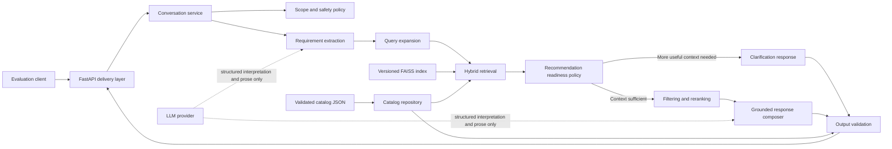
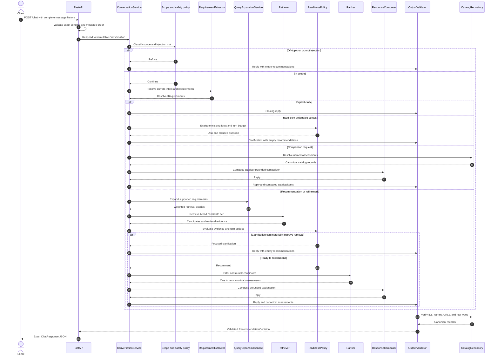
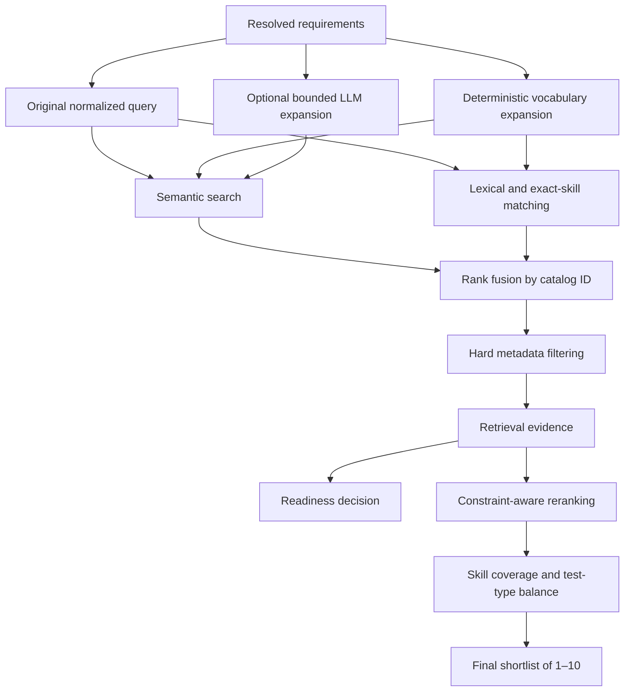
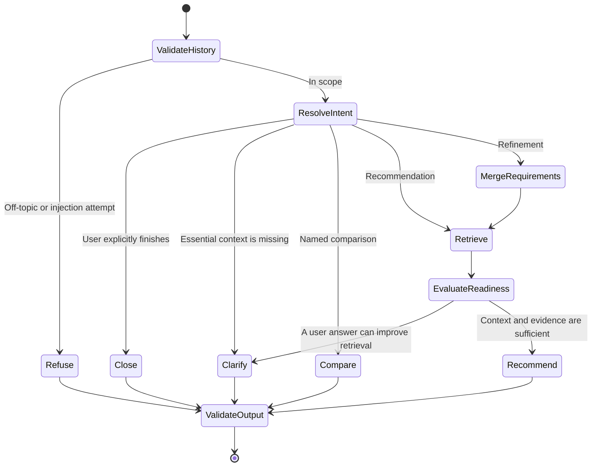
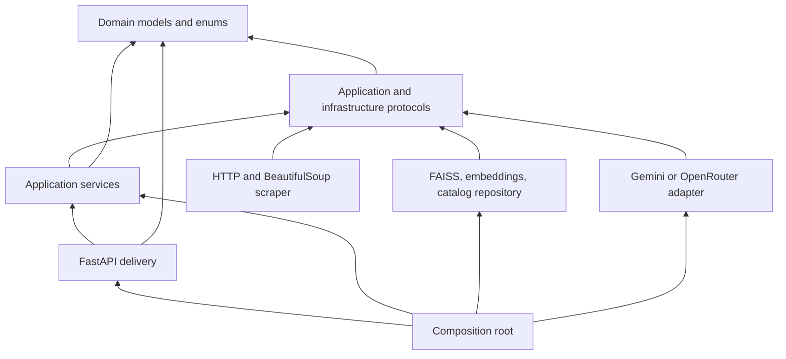
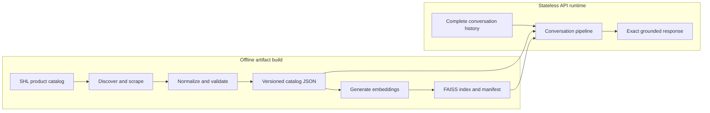

# Architecture

## Purpose

The SHL Assessment Recommendation Agent is a stateless conversational system that helps a
user clarify assessment needs, recommends one to ten SHL Individual Test Solutions, refines
earlier recommendations, and compares catalog assessments.

The central architectural rule is that the language model is not a source of catalog truth.
It can interpret conversation and compose natural language, but deterministic application
code controls which assessments and URLs may leave the system.

## High-level architecture



The catalog and vector index are built offline. Request handling never scrapes SHL pages,
rebuilds embeddings, or trusts the language model to invent product identity.

## `POST /chat` sequence



Each request is independent. The service reconstructs the current conversational state from
the supplied history and stores no per-conversation data.

## Retrieval pipeline



### Retrieval stages

1. **Requirement resolution** converts conversation history into role, seniority, skills,
   competencies, desired test types, duration constraints, named assessments, and exclusions.
   New explicit corrections override older requirements.
2. **Query expansion** creates a small set of weighted retrieval views. The original wording
   receives the highest weight. Expansions are retrieval hints and never become user facts.
3. **Candidate generation** searches semantically through FAISS and lexically for exact
   technologies, abbreviations, and assessment names.
4. **Rank fusion** merges results by stable catalog ID. A transparent method such as Reciprocal
   Rank Fusion prevents incomparable raw scores from being combined directly.
5. **Metadata filtering** applies hard constraints such as maximum duration and requested test
   type where catalog data supports them.
6. **Retrieval evidence** records semantic, lexical, metadata, and fused scores together with
   skill coverage, constraint coverage, score margin, and calibrated query-level confidence.
7. **Reranking** rewards requirement coverage, relevance, and balanced hard-skill and
   behavioral coverage. Candidate retrieval remains broad to protect Recall@10.
8. **Shortlist validation** maps results back to canonical catalog records and limits the
   response to one through ten unique items.

Raw FAISS similarity is not treated as confidence. Confidence must be calibrated against
labeled conversation traces and used as one readiness signal rather than an automatic
clarification threshold.

## Conversation pipeline



### Behavioral rules

- **Clarification:** Ask one high-value question when the request lacks an actionable role,
  skill, competency, test type, or assessment name. Return an empty recommendation array.
- **Recommendation:** Commit to one through ten assessments when enough context exists. Prefer
  a broader relevant shortlist where it protects Recall@10.
- **Refinement:** Reconstruct requirements from the complete history, preserve compatible
  facts, and let newer explicit corrections supersede older facts. Retrieve and rank again.
- **Comparison:** Resolve assessment names against the catalog and compare only documented
  properties. Ambiguous or unknown names trigger clarification rather than guessing.
- **Refusal:** Reject general hiring advice, legal questions, unrelated requests, and
  prompt-injection attempts. Return an empty recommendation array.
- **Closure:** Set `end_of_conversation` to `true` only when the user explicitly completes or
  closes the task. An ordinary initial shortlist remains open to refinement.
- **Turn budget:** The evaluator permits at most eight user and assistant messages. The agent
  does not repeat questions and proceeds with available facts if the user has no preference.

## Component responsibilities

| Component | Responsibility | Must not do |
| --- | --- | --- |
| FastAPI delivery layer | Validate HTTP schemas, map API models to domain models, map domain decisions back to exact response JSON | Contain recommendation policy or provider logic |
| `ConversationService` | Orchestrate one stateless turn and coordinate all policies and services | Store conversation state |
| Scope and safety policy | Detect unsupported requests and instruction attacks | Select catalog products |
| `RequirementExtractor` | Resolve intent and current constraints from the complete history | Treat expansions or model guesses as user facts |
| `QueryExpansionService` | Produce bounded, weighted retrieval views | Invent product names or URLs |
| `Retriever` | Generate broad hybrid candidates and retrieval evidence | Commit to the final shortlist |
| `RecommendationReadinessPolicy` | Decide whether clarification can materially improve the result | Treat raw similarity as calibrated confidence |
| `RecommendationRanker` | Filter, balance, diversify, and rank candidates | Return an item absent from the repository |
| `CatalogRepository` | Serve immutable canonical assessment records | Fetch live catalog pages during a request |
| `EmbeddingProvider` | Produce normalized vectors with a fixed model and dimension | Apply conversational policy |
| `VectorIndex` | Map vectors to stable catalog IDs and similarity scores | Store canonical product metadata |
| `ResponseComposer` | Produce concise grounded prose from trusted inputs | Create or alter recommendation identity |
| Output validator | Enforce count, uniqueness, schema, catalog membership, and canonical URLs | Repair unknown products by guessing |
| Catalog scraper | Discover and parse Individual Test Solutions offline | Run inside `/chat` |
| Index builder | Embed validated catalog records and create a versioned FAISS artifact offline | Rebuild the index during API startup |
| Settings | Validate immutable environment configuration and secrets | Log secret values |
| Logging | Emit structured operational events and request correlation | Record credentials or unrestricted conversation text |

## Dependency graph

Dependencies point inward toward stable domain abstractions.



The domain layer has no dependency on FastAPI, Pydantic, FAISS, Sentence Transformers, or an
LLM SDK. Protocols express required behavior; concrete adapters satisfy those protocols.
The composition root is the only place that chooses implementations.

This structure supports:

- replacing Gemini with OpenRouter without changing conversation logic;
- replacing FAISS without changing ranking or API models;
- testing orchestration with deterministic fakes;
- running the scraper independently from the API;
- enforcing catalog truth at a single repository boundary.

## Folder structure

```text
.
├── data/
│   ├── raw/
│   ├── processed/
│   └── indexes/
├── deployment/
├── docs/
├── src/
│   └── shl_agent/
│       ├── api/
│       │   └── models/
│       ├── models/
│       ├── prompts/
│       ├── retrieval/
│       ├── scraper/
│       ├── services/
│       └── utils/
└── tests/
    ├── contract/
    ├── evaluation/
    ├── fixtures/
    ├── integration/
    ├── security/
    └── unit/
```

### Folder explanation

- `data/raw`: source snapshots and intermediate scraping artifacts. These are retained for
  reproducibility but are not loaded by the API.
- `data/processed`: normalized, deduplicated, schema-validated catalog JSON.
- `data/indexes`: the FAISS index and manifest tying it to the catalog version, embedding
  model, dimension, record count, and checksums.
- `deployment`: Docker-host deployment configuration, currently including Render.
- `docs`: interview and engineering documentation, including this architecture description.
- `src/shl_agent/api`: FastAPI application factory and future route/dependency adapters.
- `src/shl_agent/api/models`: strict evaluator-facing Pydantic request and response schemas.
- `src/shl_agent/models`: immutable framework-independent domain entities and value objects.
- `src/shl_agent/prompts`: versioned system, extraction, expansion, and response prompts.
- `src/shl_agent/retrieval`: repository, embedding, index, and retrieval contracts plus future
  adapters.
- `src/shl_agent/scraper`: offline catalog discovery, fetching, parsing, normalization, and
  validation.
- `src/shl_agent/services`: use-case orchestration, conversational policies, and the dependency
  composition root.
- `src/shl_agent/utils`: cross-cutting configuration, structured logging, and narrowly scoped
  utilities.
- `tests/unit`: isolated domain, policy, parsing, ranking, and validation tests.
- `tests/integration`: collaboration tests across adapters and application services.
- `tests/contract`: exact API serialization and HTTP contract tests.
- `tests/security`: prompt injection, scope enforcement, URL integrity, and input-abuse tests.
- `tests/evaluation`: complete conversation replay, Recall@10, behavioral probes, clarification
  efficiency, and hallucination measurements.
- `tests/fixtures`: saved HTML pages, catalog records, and conversation traces used by tests.

## Runtime and offline boundaries



Separating these boundaries reduces request latency, avoids runtime dependence on SHL website
availability, makes catalog changes auditable, and ensures every returned URL originates from
a known artifact.

## Reliability and evaluation

The service is designed around the assignment's hard limits:

- exact schema compliance on every response;
- 100% recommendation membership in the scraped catalog;
- at most eight conversation messages;
- a 30-second request timeout;
- one to ten recommendations only after committing to a shortlist;
- empty recommendations while clarifying or refusing.

The primary quality metric is Mean Recall@10, but it is insufficient by itself. Engineering
evaluation also tracks candidate Recall@30/50, catalog-validity rate, schema-validity rate,
constraint compliance, unnecessary clarification rate, completion within the turn budget,
behavior-probe pass rate, latency, and hallucination rate.

Retries are restricted to transient external failures, bounded by the request deadline, and
use exponential backoff with jitter. Retrieval and validation remain local so provider failure
cannot cause invented catalog output.

